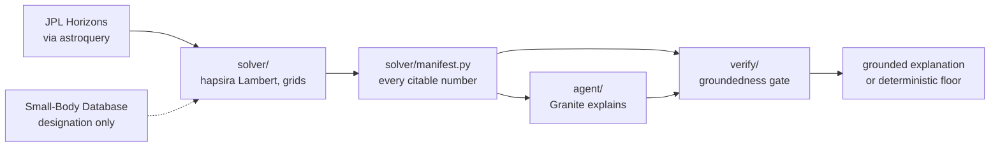

# HITS | Hyperbolic Intercept & Trajectory Solver

*Can we catch it? Expert-level intercept analysis, open to everyone.*

HITS is an accessibility layer over NASA data services that answers one
question about an interstellar object: could we send a probe to it?
Deterministic orbital mechanics computes the answer, an IBM Granite agent
interprets it, and a deterministic gate checks every number in that
interpretation against solver output before a reader sees it.

**Status.** The solver, the groundedness gate, and the agent layer are built
and tested (191 passed, 1 skipped, 1 xfailed). The API, the web frontend, the
judges endpoints, and the deployment are not built yet, and nothing below
describes them as though they were.

---

## Problem statement

The demand was measured rather than assumed. In July 2026 we collected 14,293
top-level YouTube comments from six NASA Jet Propulsion Laboratory videos,
extracted the questions, reduced the sentence embeddings with UMAP, and
clustered them with HDBSCAN. Of 3,171 extracted questions in 59 clusters, the
two largest technical themes were travel time and mission windows (~170
questions) and interstellar characterization and intercept (~85). View counts
point the same way: across 30 sampled recent JPL uploads views ran from 4,000
to 60,000, while the 3I/ATLAS explainer posted in the same period recorded
511,000.

Software that computes intercept trajectories exists and has since 1964. None
of it is usable by the people asking.

| Tool | Status | Barrier |
|---|---|---|
| GMAT (NASA) | Free, open source | Mission-design expertise required |
| OITS (Project Lyra) | Open source | Orbital mechanics knowledge plus code setup |
| OTIS (NASA) | Restricted | Distribution limited to domestic United States use |
| TRACE (The Aerospace Corporation) | Internal | Never publicly released |

The claim is not that no software exists. It is the narrower and defensible
one: no *accessible* tool exists. Full method, raw corpora, cluster report and
stated limits are in `docs/EVIDENCE.md` and `/data`.

## Solution description

HITS takes an interstellar target from NASA's small-body catalogs, pulls state
vectors from JPL Horizons through astroquery (`solver/fetch.py`), solves Lambert transfers over the hyperbolic orbit
across a grid of departure dates and flight times, and reports what the
intercept costs in C3 and arrival velocity. A Granite agent turns that output
into plain language, and every numeric token it writes is checked against the
solver's own manifest before the explanation is returned.

What it is not is load-bearing, because it is what keeps the claim narrow.
HITS is not a replacement for GMAT and answers one question rather than many.
It is not a classifier of natural versus artificial objects, a question
observational data answers and orbital elements do not. It does not model
launch-vehicle capability, so it reports what a transfer costs and leaves the
go/no-go judgement to the reader. It models patched-conic transfers, not
n-body integration, and does not model non-gravitational forces.

## AI approach and architecture



The solver computes and the model interprets. That split is enforced by
ordering: the solver runs first and completes, the agent receives structured
output, and the agent cannot trigger a recomputation with different
parameters. Because the set of legitimate numbers is therefore fixed before
generation begins, the check is tractable. `solver/manifest.py` emits every
citable quantity for a call, one canonical value with several declared
renderings from a pinned ladder, and `verify/groundedness.py` compares every
numeric token in a candidate explanation against that index. Membership is
dispositive and the matching path performs no arithmetic at all, which an AST
test enforces.

A rejected candidate is regenerated at most twice with the specific rejected
tokens fed back. If it still fails, `agent/template.py` serves a deterministic
floor built only from manifest renderings, and that floor is gated like any
other candidate. Every response carries `served_by`, one of
`granite_first_pass`, `granite_after_regen` or `deterministic_floor`, so a
templated answer is never mis-credited to Granite. If watsonx is unreachable
or no credentials are present, the numbers still compute and still render.

The gate certifies grounding, not truth. This is stated in full, with the
first live run that demonstrated it, under Limits.

## Selected challenge theme

August Space Exploration Challenge, solution area: mission planning and
optimization. The measured demand in the corpus is specifically about mission
feasibility, travel time and intercept windows, which is a trajectory
optimization question being asked by people who cannot run a trajectory
optimizer. HITS puts the optimization behind an interface that does not
require mission-design training, which is the same solution area approached
from the accessibility side rather than the capability side.

## How IBM Bob was used

IBM Bob was the primary development tool for Phase 1: the Lambert solver core
over hyperbolic targets, the Horizons fetch and committed state vectors, the
grid, the C3 porkchop plot, and the validation suite against Hein et al. 2019.
Bob then authored the Phase 2 adversarial corpus black-box, working from a
redacted manifest view without sight of the gate, and that submission is
committed as `tests/corpus/bob_submission.raw.jsonl`. Claude Code took over at
the Phase 1/2 boundary and built the groundedness gate and the agent layer on
top of Bob's solver.

Every commit in this repository is authored by one human committer, so git
carries no tool authorship. The record of which tool did what is
`docs/BOB_USAGE.md`, written session by session as the work happened, and it
is the only evidence for the split. `docs/HARNESS.md` describes the process
discipline the two tools worked under.

## Verification

The solver reproduces five published quantities from Project Lyra's
'Oumuamua study (Hein et al. 2019, Acta Astronautica 161, 552-561). The
largest disagreement is 4.92%.

| Quantity | HITS | Published | Difference |
|---|---|---|---|
| Perihelion v_inf (frame gate) | 26.286 km/s | 26.33 km/s | 0.044 km/s |
| C3, 2027 launch | 1331.16 km²/s² | 1400 km²/s² | 4.92% |
| C3 floor | 714.36 km²/s² | 703 km²/s² | 1.62% |
| Sample A arrival v_inf2 | 13.967 km/s | 13.6 km/s | 0.367 km/s |
| Sample B arrival v_inf2 | 0.642 km/s | 0.6 km/s | 0.042 km/s |

One image carries all five: `plots/validation_comparison.html`, every quantity
on a unit-free axis against the tolerance declared for it.

The remaining gaps are attributed to orbit-solution epoch drift between Lyra's
2019 ephemeris and the 2026-08-27 retrieval, and that attribution is argued
rather than asserted in `docs/PROVENANCE.md`. Full claim-and-step table, with
every unbuilt check named as unbuilt: `docs/VERIFICATION.md`.

The criteria-to-evidence mapping will live on the judges page at `/judges`,
which is the next build. Until it ships, the mapping is this section and
`docs/VERIFICATION.md`.

## Limits

HITS models patched-conic transfers. It does not perform n-body integration,
does not model solar radiation pressure or other non-gravitational forces, and
has no launch-vehicle model, so delta-v is a requirement rather than a
capability match. Horizons ephemerides update as observations accumulate, so
numbers carry the date they were computed.

The gate has standing limits of its own, and they are written down because a
gate whose limits are unstated invites the belief that it has none. It cannot
see a real number attached to the wrong result within one manifest; two such
cases are held as accepted limits in `tests/corpus/known_limits.jsonl` rather
than counted as catches. It cannot say what kind of wrong a number is, because
telling a near-miss from an invention means arithmetic it is forbidden, so
both are rejected as `fabricated-number`. Granite Guardian is not wired in and
every verdict reports its advisory field as unavailable.

Most importantly, a grounded explanation is not necessarily a correct one. The
first live run on 2026-08-30 returned an explanation carrying only manifest
renderings that still said the 2027 C3 comparison "exceeds the solver's
tolerance of 20%" when 4.92% is inside it. Every number was grounded and the
claim about them was false. Membership and attribution do not check a
comparative assertion.

## Run it

The deployment is not built. Today HITS runs locally, and the validation runs
offline against committed state vectors with no credentials and no network.

```
python -m venv .venv && . .venv/bin/activate
pip install --no-deps -r requirements.txt
pytest                              # full suite
pytest tests/test_validation.py -v  # the five Lyra comparisons, printed
```

Python 3.12. `--no-deps` is deliberate and `docs/VERIFICATION.md` explains it:
requirements.txt is a complete pinned set, and resolving hapsira's matplotlib
bound would downgrade NumPy, which would change computed numbers. The same
install and suite run in CI on every push (`.github/workflows/ci.yml`).

The explanation layer is the only part that reads a credential;
copy `.env.example` to `.env` to supply watsonx settings. Without it, the
solver runs unchanged and explanations are served by the deterministic floor.

## Repository layout

```
solver/   orbital mechanics, validation, manifest emitter
verify/   extraction rule, groundedness gate, adversarial corpus loader
agent/    Granite client, generate-and-gate loop, deterministic floor
tests/    191 tests, including the corpus and the invariant proofs
data/     comment corpora, cluster report, committed state vectors, Lyra PDF
docs/     architecture, verification, manifest contract, process record
specs/    mission, tech stack, roadmap
plots/    C3 porkchop slice
```

## Documents

- `specs/mission.md`
- `specs/tech-stack.md`
- `specs/roadmap.md`
- `docs/EVIDENCE.md`
- `docs/VERIFICATION.md`
- `docs/ARCHITECTURE.md`
- `docs/MANIFEST.md`
- `docs/CORPUS.md`
- `docs/PROVENANCE.md`
- `docs/CONVENTIONS.md`
- `docs/GLOSSARY.md`
- `docs/IBM_STACK.md`
- `docs/BOB_USAGE.md`
- `docs/HARNESS.md`
- `CLAUDE.md`
