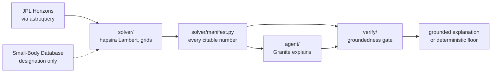

# HITS | Hyperbolic Intercept & Trajectory Solver

*Can we catch it? Expert-level intercept analysis, open to everyone.*

The intercept math exists. It has existed at NASA and in aerospace tools since
1964, most of it is free, and some of it is a download away. What it is not is
reachable.

**The capability isn't missing. It's locked away, four ways:**

- **Expertise.** [GMAT](https://software.nasa.gov/software/GSC-17177-1) (NASA)
  is free and open source. It is an environment to work in, not a question you
  can ask.
- **Expertise, and a toolchain.**
  [OITS](https://github.com/AdamHibberd/Optimum_Interplanetary_Trajectory)
  (Project Lyra) is free and open source, and needs MATLAB, the SPICE toolkit,
  and the NOMAD optimizer, plus knowing which bodies to sequence.
- **A border.** [OTIS](https://software.nasa.gov/software/LEW-20403-1) (NASA
  Glenn) is free and U.S. release only. NASA's own catalog entry limits
  distribution to domestic United States use.
- **A closed door.** TRACE (The Aerospace Corporation) is internal, and was
  never publicly released.

**And the people locked out are the ones asking.** 3,171 questions pulled out of
19,122 comments on six NASA JPL videos, where the two largest technical themes
are how long it would take and whether we could catch it. None of those people
is going to install GMAT.

**HITS is that capability with the barrier removed.** It computes real intercept
trajectories over the hyperbolic orbits of all three interstellar objects
humanity has found, 1I/'Oumuamua, 2I/Borisov and 3I/ATLAS, and says in plain
language what such a mission would cost. Every number in an answer is checked
against solver output before it is shown, and every answer carries a field
saying what backs it, because only 'Oumuamua has a published study to be
validated against.

**Status.** The solver, the three-object set, the groundedness gate, and the
agent layer are built and tested (240 passed, 1 skipped, 1 xfailed). The API,
the web frontend, the judges endpoints, and the deployment are not built yet,
and nothing below describes them as though they were.

---

## The exchange

> **You ask:** Can we catch 'Oumuamua?
>
> **HITS answers:**
>
> Catching 1I/'Oumuamua would mean leaving Earth with 393.34 km^2/s^2 of launch energy, a very high-energy departure, and then flying for 1 year to reach it. Every interstellar object is high-energy to chase, because none of them is in orbit around the Sun and all of them are leaving it at speed. What follows is the size of that cost, worked out, and not a judgement on whether it could be met.
>
> A trajectory connecting Earth to the target exists for the departure asked about. Leaving Earth on 2017-06-07 and arriving on 2018-06-07, the flight time is 365 days, or 1 year. That such a trajectory exists is geometry, and geometry is nearly always obliging; what separates one departure from another is what it costs to fly.
>
> Reaching it from an Earth-relative departure costs 393.34 km^2/s^2 of characteristic energy, which is a hyperbolic excess speed of 19.8328 km/s once clear of Earth.
>
> The probe would meet the target at 13.71605 km/s in the target-relative frame, which is the speed it passes at. Its asymptotic arrival relative velocity, the quantity the mission-design literature compares against, is 13.96737 km/s.
>
> What HITS settles here is the trajectory, not the launch vehicle. It computes what the transfer costs and does not model launcher capability, so the departure energy above is the input to a feasibility judgement rather than the judgement itself. Which means this answer reads the same way whatever the size of that figure. A departure energy an existing launcher could supply, and a departure energy far past anything ever flown, come back in identical sentences, because HITS has no launcher model with which to tell them apart. Nothing above should be read as HITS having found the mission flyable.
>
> All figures are patched-conic, two-body. HITS does not perform n-body integration and does not model non-gravitational forces, so a figure is a faithful record of what the solver computed rather than a claim that it is right to the precision it is quoted at.

Granite generates the explanation, the gate checks every numeric token in it
against the solver's manifest, and a rejected candidate is regenerated with the
offending tokens fed back; only if that still fails does the deterministic
floor answer instead, and `served_by` names whichever path did. Since the gate
learned to read dates and unit spellings whole, Granite cleared it ten times in
fifteen, five live runs on each of the three objects. The block above is
verbatim from a run on 2026-08-30 that fell through to the floor,
`served_by: deterministic_floor`, and the floor is what is quoted here because
it is the one path a reader reproduces offline, without credentials, byte for
byte. The gate certifies grounding and not truth: it checks where a number came
from, never whether the sentence around it is true.

## The demand


The 3,171 questions above, clustered. Travel time and intercept are the two
largest technical themes, and they are the two HITS answers. The largest
clusters in the corpus overall are not technical at all, and the chart shows
those too.

<p align="center">
  
  
  
  
  
  
</p>

The six NASA JPL videos the demand was read from.

---

## Problem statement

The claim is not that no software exists. It is the narrower and defensible
one: no *accessible* tool exists. All four tools listed at the top of this page
are real, three of the four are free, and not one of them will answer a
question put to it by somebody who does not already know how to ask.

How the demand above was measured, with the extraction rule, the clustering
parameters, and the stated limits, is in `docs/EVIDENCE.md`; the corpora and
the cluster report are in `/data`.

## Solution description

One URL, no clone, no orbital mechanics: pick one of the three interstellar
objects and read what a mission to it would cost.

The three are a committed set rather than a text field, because a typed
designation would need a live Horizons call at request time and would end the
guarantee that a judge's re-run gets the same numbers back. `solver/objects.py`
holds the set and raises on anything else rather than guessing.

**What it is not** is load-bearing, because it is what keeps the claim narrow:

- **Not a replacement for GMAT.** It answers one question rather than many.
- **Not a classifier of natural versus artificial objects.** Observational data
  answers that question; orbital elements do not.
- **Not a launch-vehicle model.** It reports what a transfer costs and leaves
  the go/no-go judgement to the reader.
- **Not a full-fidelity propagator.** Patched-conic transfers only, with the
  fidelity limits stated under Limits.

## AI approach and architecture



The solver computes and the model interprets. That split is enforced by
ordering: the solver runs first and completes, the agent receives structured
output, and the agent cannot trigger a recomputation with different
parameters. Because the set of legitimate numbers is therefore fixed before
generation begins, the check is tractable. `solver/manifest.py` emits every
citable quantity for a call, one canonical value with several declared
renderings from a pinned ladder, and `verify/groundedness.py` compares every
numeric token in a candidate explanation against that index. Membership is
dispositive and the matching path performs no arithmetic at all, which an AST
test enforces.

A rejected candidate is regenerated at most twice with the specific rejected
tokens fed back. If it still fails, `agent/template.py` serves a deterministic
floor built only from manifest renderings, and that floor is gated like any
other candidate. The `served_by` field named above is one of
`granite_first_pass`, `granite_after_regen` or `deterministic_floor`. If
watsonx is unreachable or no credentials are present, the numbers still
compute and still render.

## Selected challenge theme

August Space Exploration Challenge, solution area: mission planning and
optimization. The demand measured above is a trajectory optimization question
being asked by people who cannot run a trajectory optimizer, so HITS approaches
that solution area from the accessibility side rather than the capability side.

## How IBM Bob was used

IBM Bob was the primary development tool for Phase 1, the part that computes:
the Lambert solver over hyperbolic targets, the Horizons fetch and committed
state vectors, the grid, the C3 plot, and the validation suite against Hein et
al. 2019. Bob then authored the 35-case adversarial corpus black-box, without
sight of the gate it attacks. Claude Code took over at the Phase 1/2 boundary
for the groundedness gate and the agent layer.

Every commit here is authored by one human committer, so git carries no tool
authorship and the record of which tool did what is `docs/BOB_USAGE.md`,
written session by session as the work happened. `docs/HARNESS.md` describes
the process discipline both tools worked under.

## Verification

The solver reproduces five published quantities from Project Lyra's
'Oumuamua study (Hein et al. 2019, Acta Astronautica 161, 552-561). The
largest disagreement is 4.92%. Every row below is 1I/'Oumuamua, and there is
no equivalent table for the other two objects because there is nothing to put
in it: no intercept study has been published for 2I/Borisov or 3I/ATLAS. They
are computed by the same method, over state vectors fetched down the same path
and frame-checked against the elements Horizons reports for the same body at
the same epoch, and validated against nothing. Each object carries that
distinction as a `verification_status` field rather than as a footnote, so a
reader who sees only one answer still sees what backs it.

| Quantity | HITS | Published | Difference |
|---|---|---|---|
| Perihelion v_inf (frame gate) | 26.286 km/s | 26.33 km/s | 0.044 km/s |
| C3, 2027 launch | 1331.16 km²/s² | 1400 km²/s² | 4.92% |
| C3 floor | 714.36 km²/s² | 703 km²/s² | 1.62% |
| Sample A arrival v_inf2 | 13.967 km/s | 13.6 km/s | 0.367 km/s |
| Sample B arrival v_inf2 | 0.642 km/s | 0.6 km/s | 0.042 km/s |


Every quantity on a unit-free axis against the tolerance declared for it. The
interactive version with hover detail is `plots/validation_comparison.html`.

The remaining gaps are attributed to orbit-solution epoch drift between Lyra's
2019 ephemeris and the 2026-08-27 retrieval, and that attribution is argued
rather than asserted in `docs/PROVENANCE.md`. Full claim-and-step table, with
every unbuilt check named as unbuilt: `docs/VERIFICATION.md`.

The criteria-to-evidence mapping will live on the judges page at `/judges`,
which is the next build. Until it ships, the mapping is this section and
`docs/VERIFICATION.md`.

## Limits

HITS models patched-conic transfers. It does not perform n-body integration,
does not model solar radiation pressure or other non-gravitational forces, and
has no launch-vehicle model, so delta-v is a requirement rather than a
capability match. Horizons ephemerides update as observations accumulate, so
numbers carry the date they were computed.

The gate has standing limits of its own, and they are written down because a
gate whose limits are unstated invites the belief that it has none. It cannot
see a real number attached to the wrong result within one manifest; two such
cases are held as accepted limits in `tests/corpus/known_limits.jsonl` rather
than counted as catches. It cannot say what kind of wrong a number is, because
telling a near-miss from an invention means arithmetic it is forbidden, so
both are rejected as `fabricated-number`. Granite Guardian is not wired in and
every verdict reports its advisory field as unavailable.

Most importantly, a grounded explanation is not necessarily a correct one. The
first live run on 2026-08-30 returned an explanation carrying only manifest
renderings that still said the 2027 C3 comparison "exceeds the solver's
tolerance of 20%" when 4.92% is inside it. Every number was grounded and the
claim about them was false. Membership and attribution do not check a
comparative assertion.

## Run it

The deployment is not built. Today HITS runs locally, and the validation runs
offline against committed state vectors with no credentials and no network.

```
python -m venv .venv && . .venv/bin/activate
pip install --no-deps -r requirements.txt
pytest                              # full suite
pytest tests/test_validation.py -v  # the five Lyra comparisons, printed
```

Python 3.12. `--no-deps` is deliberate and `docs/VERIFICATION.md` explains it:
requirements.txt is a complete pinned set, and resolving hapsira's matplotlib
bound would downgrade NumPy, which would change computed numbers. The same
install and suite run in CI on every push (`.github/workflows/ci.yml`).

The explanation layer is the only part that reads a credential;
copy `.env.example` to `.env` to supply watsonx settings. Without it, the
solver runs unchanged and explanations are served by the deterministic floor.

## Repository layout

```
solver/   orbital mechanics, the three-object set, validation, manifest emitter
verify/   extraction rule, groundedness gate, adversarial corpus loader
agent/    Granite client, generate-and-gate loop, deterministic floor
tests/    242 tests, including the corpus and the invariant proofs
data/     comment corpora, cluster report, committed state vectors, Lyra PDF
docs/     architecture, verification, manifest contract, process record
specs/    mission, tech stack, roadmap
plots/    C3 porkchop slice, demand clusters, validation comparison
```

## Documents

- `specs/mission.md`
- `specs/tech-stack.md`
- `specs/roadmap.md`
- `docs/EVIDENCE.md`
- `docs/VERIFICATION.md`
- `docs/ARCHITECTURE.md`
- `docs/MANIFEST.md`
- `docs/CORPUS.md`
- `docs/PROVENANCE.md`
- `docs/CONVENTIONS.md`
- `docs/GLOSSARY.md`
- `docs/IBM_STACK.md`
- `docs/BOB_USAGE.md`
- `docs/HARNESS.md`
- `CLAUDE.md`
